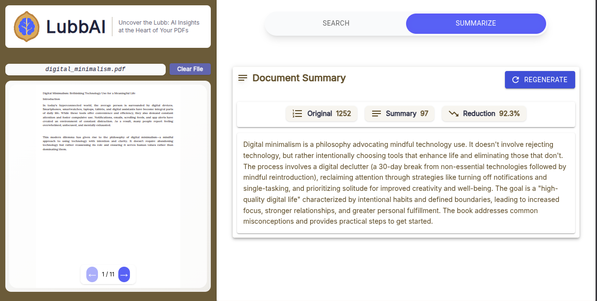

# LubbAI — PDF Semantic Search & Summarization App

**LubbAI** is a semantic search and summarization tool for PDF documents. It extracts the core meaning (*lubb*) of your content using advanced AI models (OpenAI/Gemini).

---

A modern three-tier web application that lets users upload a PDF, search its contents semantically, and get concise summaries using OpenAI or Google Gemini (current version).

## 🗂️ Project Structure

```text
LubbAI/
├── core/      # Python AI logic for PDF processing, embeddings, search, summarization
├── server/    # Node.js REST API for upload, search, and summarization endpoints
├── client/    # React frontend: upload, semantic search, summary view
├── _data/     # (Optional) Data storage, intermediate files, or output artifacts
├── _samples/  # (Optional) Example PDFs or sample data for testing/demo
└── README.md  # Project documentation
```

### Folder Breakdown
- **core/**: Python code for extracting, chunking, embedding, searching, and summarizing PDF content using AI.
- **server/**: Node.js backend providing REST API endpoints for file upload, search, and summary. Bridges frontend and AI core.
- **client/**: React app for uploading PDFs, searching, and displaying semantic results and summaries in a clean UI.
- **_data/**: Stores intermediate data, output files, or artifacts generated during processing.
- **_samples/**: Contains example PDFs or sample data for demos and testing.

## 🖼️ Screenshots

Below are screenshots of the LubbAI app, showing key features and UI. (Images are ordered by filename.)

1. 
   *Home screen: Upload your PDF to get started.*

2. 
   *PDF preview with navigation controls.*

3. 
   *Semantic search results for a sample document.*

4. 
   *Switching to summary tab.*

5. 
   *Summary tab showing AI-generated summary.*

*Screenshots are located in the `screenshots/` folder at the project root.*

## 🚀 Features
- Upload and process PDF files
- Semantic search across document content
- AI-powered summary extraction
- Modern, responsive UI with PDF preview and navigation
- Supports OpenAI and Google Gemini models

## 🏗️ Architecture
- **Client** (`client/`): React frontend
- **Server** (`server/`): Node.js REST API
- **Core** (`core/`): Python AI logic

## 📦 Prerequisites
- Node.js ≥ 16
- Python ≥ 3.8
- `pip` and `virtualenv`

## ⚡ Setup

1. **Clone repository**
   ```bash
   git clone https://github.com/HafsaKaraAchira/LubbAI.git
   cd LubbAI
   ```

2. **Install dependencies for each tier**
   - **Client:**
     ```bash
     cd client
     npm install
     # or
     yarn install
     ```
   - **Server:**
     ```bash
     cd ../server
     npm install
     ```
   - **Core:**
     ```bash
     cd ../core
     pip install -r requirements.txt
     ```

## ▶️ Usage: Run the App

You can automate starting the server and client using the provided scripts:

1. **Start the server (must be started first):**
   ```bash
   ./run_server.sh
   ```
   This script will launch the Node.js backend server.

2. **Start the client (in a new terminal):**
   ```bash
   ./run_client.sh
   ```
   This script will launch the React frontend.

Then open [http://localhost:3000](http://localhost:3000) in your browser.

---

For more details, see the individual `README.md` files in each folder.
   cd LubbAI

### Core (Python)
cd core
python3 -m venv venv
source venv/bin/activate
pip install -r requirements.txt

### Server (Node)
cd ../server
npm install

### Client (React)
cd ../client
npm install


## Configure environment variables
Create a .env in each tier as needed—see tier README files.

## Running the App

From project root, open three terminals:

### Core

cd core
source venv/bin/activate
python main.py  # Optional: run tests or demo script

### Server

cd server
npm start

### Client

cd client
npm start

Then open http://localhost:3000 in your browser.
